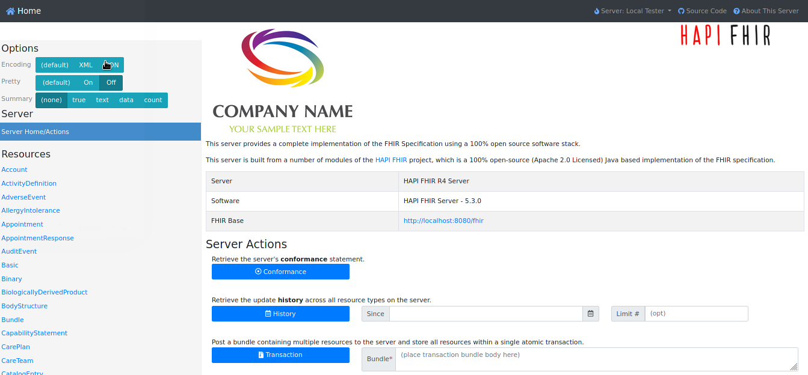

:scrollbar:
:data-uri:
:toc2:
:linkattrs:

= app-services-deploy
:numbered:

== Overview
Purpose of this project is to provide a skeleton ansible playbook that can be copied and customized to deploy your application to OpenShift in a repeatable, idempotent manner.

This project is plagarized from the ansible used to link:https://github.com/Emergency-Response-Demo/erdemo-operator[deploy the Red Hat Emergency Response Demo] to OpenShift.

For demonstration purposes, this skeleton deploys a link:https://github.com/hapifhir/hapi-fhir-jpaserver-starter[HAPI FHIR Server] and supporting PostgreSQL database to OpenShift.

== Pre-reqs 

. `oc` utility
+
All versions of this utility are available at either of the following:

.. https://access.redhat.com/downloads/content/290
+
RHN subscription required
.. https://mirror.openshift.com/pub/openshift-v4/clients/ocp/?C=M;O=D
+
Accessible without a RHN subscription
. `ansible-playbook` command line utility
+
ie: `dnf install ansible`

== Review key files and directories: 

. link:playbooks/install.yml[playbooks/install.yml]
+
Serves as the playbook that invokes all ansible roles in this project.
+
Notice that the playbook can optionally be invoked with a variable of *ACTION=install* or *ACTION=uninstall*  

. link:playbooks/group_vars/all.yml[playbooks/group_vars/all.yml]
+
Defines global scoped variables.

. link:roles[roles]
+
This directory containes all project roles.

.. _fhirserver_
+
Example role that deploys PostgreSQL database and HAPI FHIR server.
+
Notice that if a variable `-e deploy_from=source` is present, tasks in link:roles/fhirserver/tasks/deploy_from_source.yml[roles/fhirserver/tasks/deploy_from_source.yml] will be invoked.  Otherwise, the default is to invoke the tasks in link:roles/fhirserver/tasks/deploy_from_image.yml[roles/fhirserver/tasks/deploy_from_image.yml]

.. _openshift_domain_
+
Optional role that sets the following variable with the domain name of the OpenShift cluster (ie:  _apps.234.234-DEN.opentlc.com_) :  ocp_domain_host.  This task is often useful when, for example, defining a custom _hostname_ for a route.  This role can be referenced from the link:roles/fhirserver/meta/main.yml[meta/main.yml] of an invoking role.

.. _openshift_project_
+
Optional role that creates an project namespace (if it doesn't already exist)

. link:resources[resources]
+
Supporting files used by custom roles in this playbook.

== Usage

. Clone this project and at the command line change directories into this project. 

. Log into OpenShift using the `oc` command line utility.

. Execute the following to deploy the HAPI FHIR Server to OpenShift in a namespace of convention:  _user1-app-services-deploy_ 
+
-----
$ ansible-playbook playbooks/install.yml
-----
+
NOTE:  The name of the default namespace can be changed as desired by specifying the following command line argument to ansible-playbook:  `-e project_name=<change me>`.

.. At the completion of the installation, expect to see messages similar to the following:
+
-----
...

PLAY RECAP *******************************************************************************************************************************************************************************************************
localhost                  : ok=31   changed=16   unreachable=0    failed=0    skipped=3    rescued=0    ignored=0 
-----

.. Verify successful install of the HAPI FHIR server. Do so by executing the following command and pointing your browser to the URL returned by the command: 
+
-----
$ echo -en "\nhttps://$( oc get route fhir-server -n user1-app-services-deploy --template='{{ .spec.host }}' )\n"
----- 
+

. Execute the following to uninstall the HAPI FHIR Server:
+
-----
$ ansible-playbook playbooks/install.yml \
    -e ACTION=uninstall
-----

. Rename this project

. Fork this project in github and rename the forked project.

. Re-set the git `remote` in your local project such that its URL references the newly forked project in github.

. Begin customizations needed to deploy your solution to OpenShift in a repeatable and idempotent manner.
